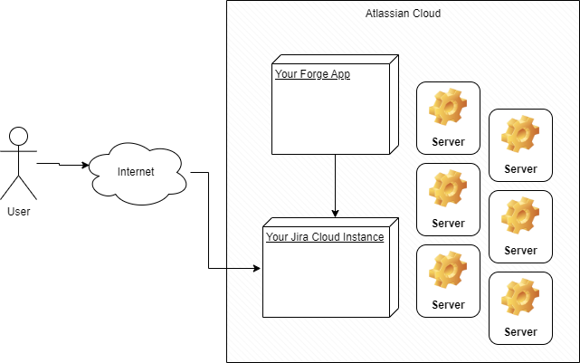
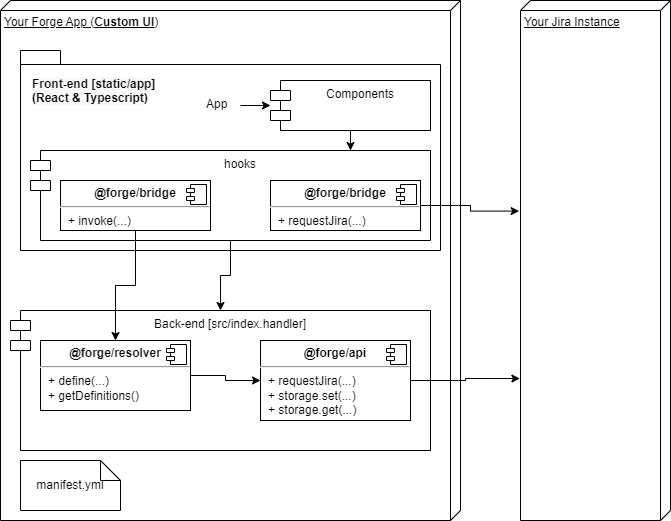

# Custom UI Example

Custom UI for more flexibility with developer-defined JavaScript, CSS, and HTML in a secured iframe hosted by Atlassian. In this case the stack is React 16 and Typescript.

Reference: 
https://developer.atlassian.com/platform/forge/custom-ui/
https://atlaskit.atlassian.com/
https://developer.atlassian.com/platform/marketplace/listing-forge-apps/

# Architecture





# Forge Hello World

This project contains a Forge app written in JavaScript that displays `Hello World!` in a Jira global page.

See [developer.atlassian.com/platform/forge/](https://developer.atlassian.com/platform/forge) for documentation and tutorials explaining Forge.

## Requirements

See [Set up Forge](https://developer.atlassian.com/platform/forge/set-up-forge/) for instructions to get set up.

## Quick start
- Install dependencies (inside of the `static/hello-world` directory)::
```
npm install
```

- Modify your app by editing the files in `static/hello-world/src/`.

- Build your app (inside of the `static/hello-world` directory):
```
npm run build
```

- Deploy your app by running:
```
forge deploy
```

- Install your app in an Atlassian site by running:
```
forge install
```

### Notes
- Use the `forge deploy` command when you want to persist code changes.
- Use the `forge install` command when you want to install the app on a new site.
- Once the app is installed on a site, the site picks up the new app changes you deploy without needing to rerun the install command.

## Support

See [Get help](https://developer.atlassian.com/platform/forge/get-help/) for how to get help and provide feedback.

